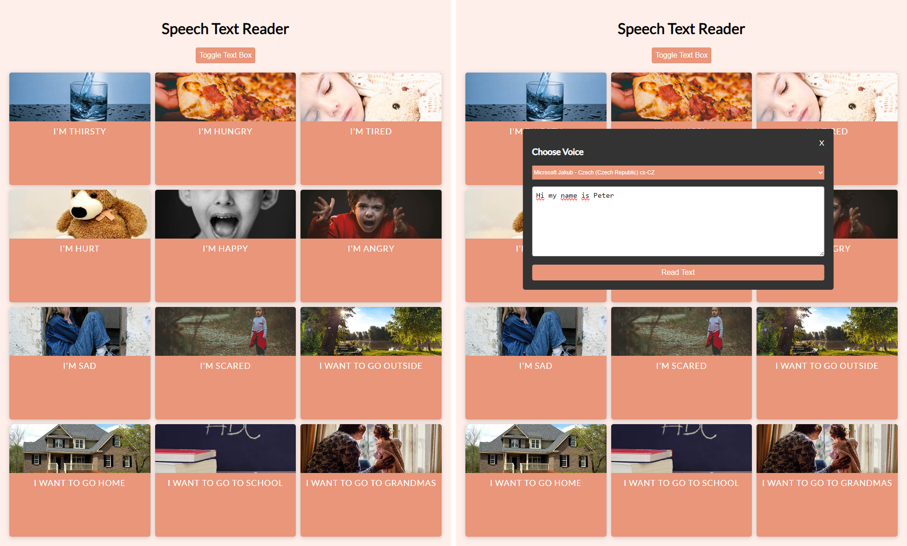
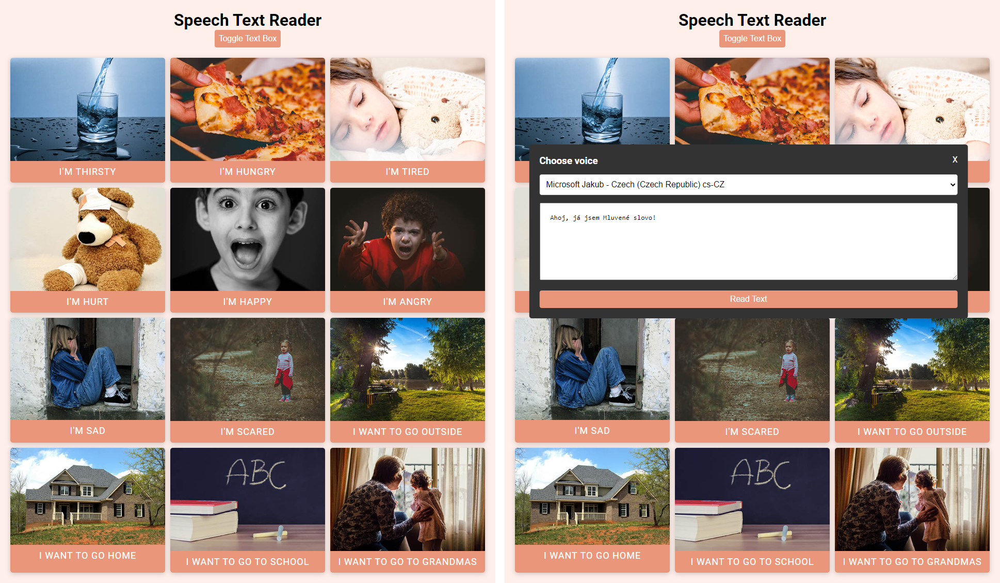

# Udemy--vanillawebprojects-13

**Thirteenth out** of a series of **20 small projects** in **Vanilla JavaScript** from the [**Udemy course**](https://www.udemy.com/course/web-projects-with-vanilla-javascript/) by author [Brad Traversy](https://www.traversymedia.com/) with this [Brad's original GitHub repository](https://github.com/bradtraversy/vanillawebprojects).

# 13: Speech Text Reader

A text to speech app for non-verbal people. Pre-made buttons and custom text speech. This project uses the Web Speech API.

## Project Specifications

- Create responsive UI (CSS Grid) with picture buttons
- Speaks the text when button clicked
- Drop down custom text to speech
- Speaks the text typed in
- Change voices and accents

## Original preview

    

## My solution preview

    

## My solution features

- same as an original

# Author

Website - [Petr Bednarski](https://github.com/pettik)  
Frontend Mentor - [@pettik](https://www.frontendmentor.io/profile/pettik)
